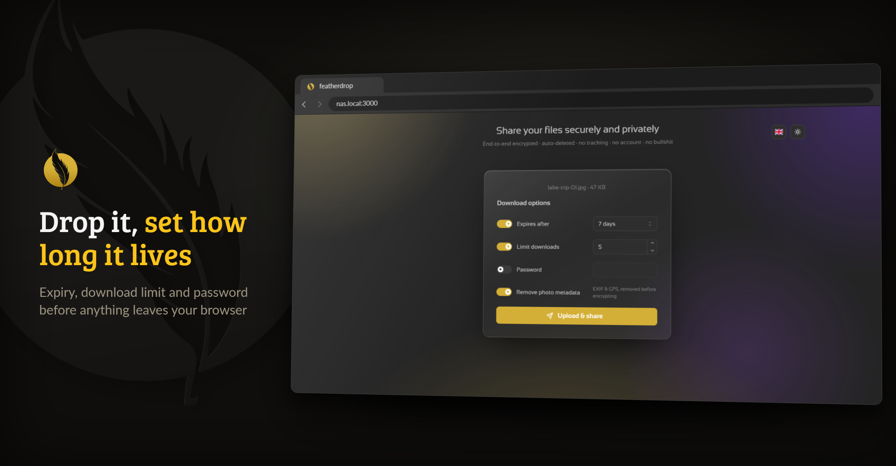
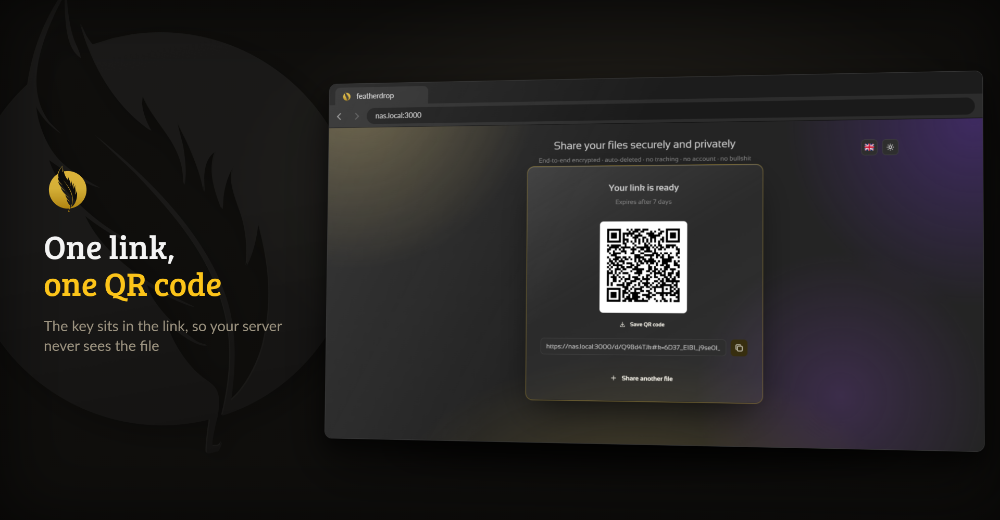
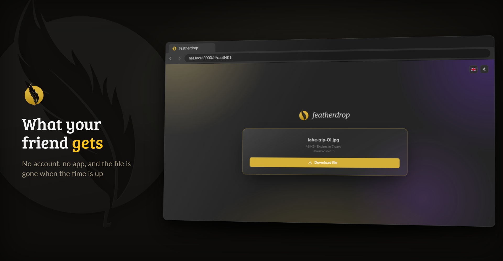

<p align="center">
  <picture>
    <source media="(prefers-color-scheme: dark)" srcset="https://raw.githubusercontent.com/junkerderprovinz/featherdrop/main/.github/assets/featherdrop-banner-dark.png">
    
  </picture>
</p>

<p align="center">
  <a href="https://github.com/junkerderprovinz/featherdrop/actions/workflows/build.yml"></a>&nbsp;
  <a href="https://github.com/junkerderprovinz/featherdrop/actions/workflows/lint.yml"></a>&nbsp;
  <a href="https://hub.docker.com/r/junkerderprovinz/featherdrop"></a>&nbsp;
  <a href="https://hub.docker.com/r/junkerderprovinz/featherdrop"></a>&nbsp;
  <a href="https://github.com/junkerderprovinz/featherdrop/pkgs/container/featherdrop"></a>&nbsp;
  <a href="https://go.dev"></a>&nbsp;
  <a href="https://mantine.dev"></a>&nbsp;
  <a href="https://unraid.net"></a>&nbsp;
  <a href="LICENSE"></a>
</p>

<p align="center">
featherdrop is a <b>feather-light</b>, self-hosted drop zone for your files. Think
<b>WeTransfer</b> or <b>Smash</b>, but it runs on your own server with no size paywall. Drop your
files (one or a whole batch), set how long they live (plus an optional password or download
limit), and share a short link or QR code. Zero-knowledge end-to-end encryption, resumable
uploads, inline previews, one tiny container. No accounts, no clouds, no tracking, no nonsense.
</p>

<!-- download-buttons: written by scripts/gen_download_buttons.py -->
<p align="center">
  <a href="https://ca.unraid.net/apps/featherdrop-1fxtgu11wume2t"></a>
  &nbsp;
  <a href="https://hub.docker.com/r/junkerderprovinz/featherdrop/"></a>
  &nbsp;
  <a href="https://github.com/junkerderprovinz/featherdrop/releases/latest"></a>
</p>
<!-- /download-buttons -->

<br>

<p align="center">
A one-knight job: I build it, keep it running, work through the issues and add what people ask for, until nothing is missing. It is free, with no accounts, no telemetry, no ads and no paid tier. No asterisk anywhere. Nothing readable ever leaves your own walls. Forged on evenings and weekends, with heart and stubbornness.
</p>

<p align="center">
If it has earned a place on your server or computer, toss a coin to your knight: it helps cover the costs and keeps the project alive. It also makes this knight's heart beat a little faster. Three ways below, whichever suits you.
</p>

<!-- give-buttons: written by scripts/gen_download_buttons.py -->
<p align="center">
  <a href="https://buymeacoffee.com/junkerderprovinz"></a>
  &nbsp;
  <a href="https://www.paypal.com/donate/?hosted_button_id=76FVV52TKXTUS"></a>
  &nbsp;
  <a href="https://junkerderprovinz.github.io/junkerderprovinz/"></a>
</p>
<!-- /give-buttons -->

<br>

## Table of Contents

1. [What it looks like](#1-what-it-looks-like)
2. [What it does](#2-what-it-does)
3. [Getting started](#3-getting-started)
4. [How AI is used here](#4-how-ai-is-used-here)
5. [Support this project](#5-support-this-project)

<br>

## 1. What it looks like

The files and links in these pictures are made up.

<p align="center">
  
  <br><em>Pick the files, then decide how long they live and how often they can be downloaded</em>
</p>

<p align="center">
  
  <br><em>The link is ready: copy it or save the QR code</em>
</p>

<p align="center">
  
  <br><em>What the recipient sees, decrypted in their browser</em>
</p>

<br>

## 2. What it does

- **Zero-knowledge.** Files are encrypted in your browser before they upload (libsodium XChaCha20-Poly1305), names included. The key lives in the link's `#fragment` or comes from the share's password, so the server and anyone with its disk only ever see ciphertext.
- **Shares that clean up after themselves.** Expiry from one hour to 30 days or never, an optional download limit and an optional password. Several files travel as one bundle under one link and come back out as the originals.
- **Big files are fine.** Uploads go in resumable 64 MiB chunks, so a dropped connection picks up where it stopped and a size-capped CDN such as Cloudflare does not get in the way.
- **Photos travel light.** JPEGs lose their EXIF and GPS data in the browser before encryption, unless you switch it off.
- **Pleasant to use.** Paste a screenshot with Ctrl+V, install it as an app and share to it from Android, preview images, video, audio, text and PDF before downloading, and read it all in 26 languages.
- **Safe to put online.** Per-IP rate limits, a storage quota, an expiry cap and an optional upload password. Share pages tell search engines to stay away.
- **One small container.** A static Go binary on a distroless base with a single SQLite file, for amd64 and arm64, with SBOM and provenance attestations and a CVE scan on every build.

It has no user accounts, no OIDC or LDAP, no email and no S3 storage. If you need those, [Pingvin Share](https://github.com/stonith404/pingvin-share) is the bigger tool that inspired this one.

<br>

## 3. Getting started

On Unraid, install **featherdrop** from [Community Applications](https://ca.unraid.net/apps/featherdrop-1fxtgu11wume2t). Anywhere else:

```sh
docker run -d --name featherdrop -p 3000:3000 \
  -e BASE_URL=https://share.yourdomain.tld \
  -e CONFIG_DIR=/config \
  -v /path/to/data:/data \
  -v /path/to/config:/config \
  junkerderprovinz/featherdrop:latest
```

Then open port 3000 and drop a file. `/data` holds the uploads and `/config` the small database, so the two can sit on different disks; leave out `CONFIG_DIR` and the `/config` mount to keep both in `/data`.

Put HTTPS in front of it before you share links outside your network. The browser needs a secure context for large uploads, streaming downloads and the clipboard, and over plain HTTP uploads stop at 500 MB. Set `BASE_URL` to the public address so the links point there, and in Nginx or Nginx Proxy Manager let big uploads through:

```nginx
client_max_body_size 0;
proxy_read_timeout 3600s;
proxy_send_timeout 3600s;
proxy_request_buffering off;
```

On an instance anyone can reach, `UPLOAD_PASSWORD` keeps strangers from uploading while every share link still works for its recipient. Behind a reverse proxy, set `TRUST_PROXY=true` so the rate limits count real visitors instead of the proxy.

<br>

## 4. How AI is used here

One knight builds this, and AI is one of the tools I work with, the same way I work with an editor or a compiler. It helps me write code and documentation and it checks my work, and that saves me a good many evenings. It does not make the decisions, though. I read and understand everything before it ships, and if something here breaks, that is on me and not on the tool.

You do not have to take my word for it. The code is open and every release note is written by hand. The issue tracker shows how problems actually get handled, including the ones I got wrong the first time. If you find something that is not right, open an issue and I will look at it.

<br>

## 5. Support this project

Questions? Check the [support thread](https://forums.unraid.net/topic/199203-support-junkerderprovinz-featherdrop/). Bugs, ideas or feature requests? Please [open a GitHub issue](https://github.com/junkerderprovinz/featherdrop/issues).

A one-knight job: I build it, keep it running, work through the issues and add what people ask for, until nothing is missing. It is free, with no accounts, no telemetry, no ads and no paid tier. No asterisk anywhere. Nothing readable ever leaves your own walls. Forged on evenings and weekends, with heart and stubbornness.

If it has earned a place on your server or computer, toss a coin to your knight: it helps cover the costs and keeps the project alive. It also makes this knight's heart beat a little faster. Three ways below, whichever suits you.

<!-- give-buttons: written by scripts/gen_download_buttons.py -->
<p align="center">
  <a href="https://buymeacoffee.com/junkerderprovinz"></a>
  &nbsp;
  <a href="https://www.paypal.com/donate/?hosted_button_id=76FVV52TKXTUS"></a>
  &nbsp;
  <a href="https://junkerderprovinz.github.io/junkerderprovinz/"></a>
</p>
<!-- /give-buttons -->

<br>

<sub>The name featherdrop, its logo and its branding are not covered by the AGPL-3.0 licence of the code: a fork needs its own name and look.</sub>
